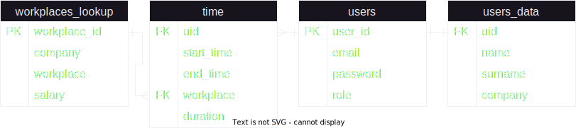

# TICTAC

TICTAC is a powerful tool designed to provide you with a comprehensive overview of your workers' working hours and salary.

## Contents

- [Instalation](#instalation)
- [How to use](#how-to-use)
- [Contributing](#contributing)
- [Autor](#autor)
- [FAQ](#faq)

## Instalation

1. Download project
2. Make sure that you have Docker Desktop installed
3. Create a PostgreSQL database either locally or online
4. Set database connection parameters in config.php
5. Build and run docker (docker-compose build -> docker-compose up)
6. Open your browser and go to localhost:8080 (the application is set up to port 8080 by default. You can change it in docker-compose.yml)

## How to use

There is two types of users: manager and worker.\
As a manager you can add, remove workers and watch time reports.\
As a worker you can add time.\
To register as a manager you need to click "or click here to register". To log in as a worker, the manager needs to create the worker and workplace first.\
Then you just log in and use tools as they were developed.

## Contributing

For any details you can write to me via email: mkida97@gmail.com\
I'll try to update this section with FAQ

## Autor

Single responsibility for design and developement belongs to Marcin Kida.

## FAQ
1. Database ERD diagram: